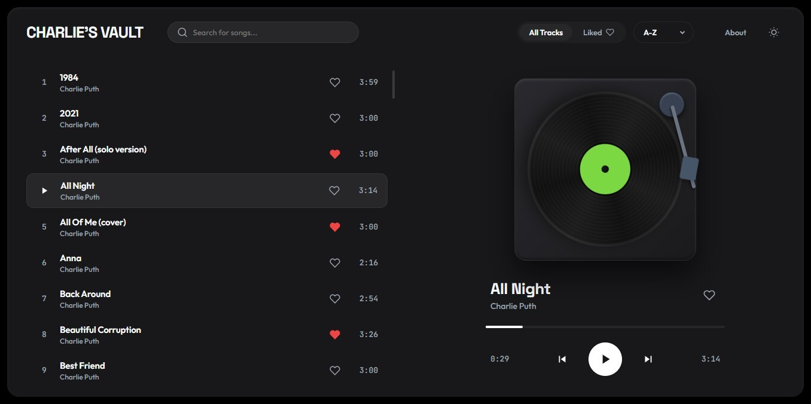

# Charlie's Vault

A listening archive of unreleased Charlie Puth tracks. Demos, acoustic recordings, early versions, things that never made it to an album — [charlies-vault.vercel.app](https://charlies-vault.vercel.app)



---


## What it does

Stream ~99 unreleased Charlie Puth tracks through a vinyl-deck player. No downloads, no stored audio. Everything plays via YouTube's IFrame API.

Desktop gets the full turntable UI. Mobile gets a floating mini-player at the bottom so you can browse while something's playing. Like tracks, search, sort, toggle dark/light mode. Preferences save to localStorage.

Single HTML file. No build step, no framework, no dependencies.

---

## Run it locally

```bash
git clone https://github.com/nishachay/charlies-vault.git
cd charlies-vault
node server.js
# http://localhost:8080
```

Stack: plain HTML, CSS, JavaScript. YouTube IFrame API for playback. Node.js for local dev only — never deployed.

---

## Files

```
charlies-vault/
├── index.html      # The whole app — CSS, JS, and song list all inlined
├── server.js       # Local dev server. Not deployed.
├── LICENSE
├── SECURITY.md
└── CONTRIBUTING.md
```

---

## Licensing

2 things in this repo, 2 different legal statuses.

**The code is MIT licensed.** The HTML, CSS, and JavaScript are mine. Copy it, fork it, build your own player with it. Just keep the copyright notice.

**The music belongs to Charlie Puth.** Every track comes from a publicly available YouTube video, streamed via YouTube's official IFrame API. No audio files in this repo. No files on any server I control. If a video gets taken down on YouTube, it stops playing here automatically.

I don't own any of this music and I'm not claiming to. This is a fan-made listening interface.

Rights holder with a concern? Open an issue or use [GitHub's private advisory](https://github.com/nishachay/charlies-vault/security/advisories/new). Takedown requests get actioned within 24 hours.

---

[CONTRIBUTING.md](CONTRIBUTING.md) · [SECURITY.md](SECURITY.md) · MIT © 2025 Nishachay (code only)
